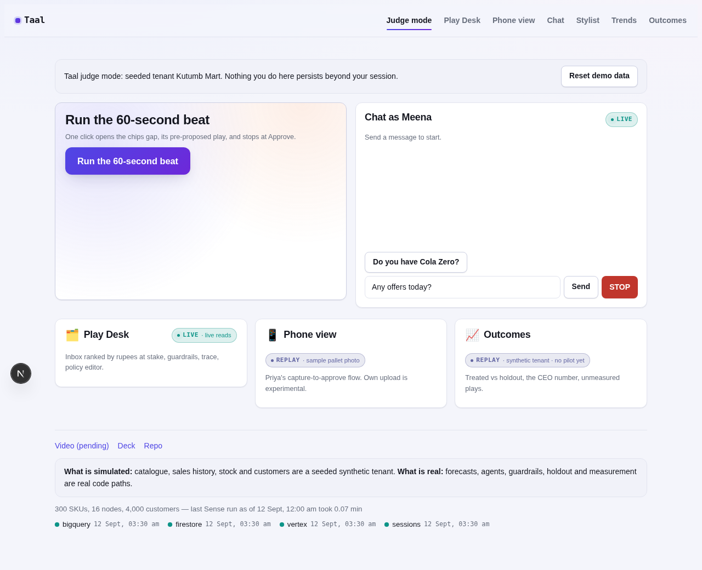
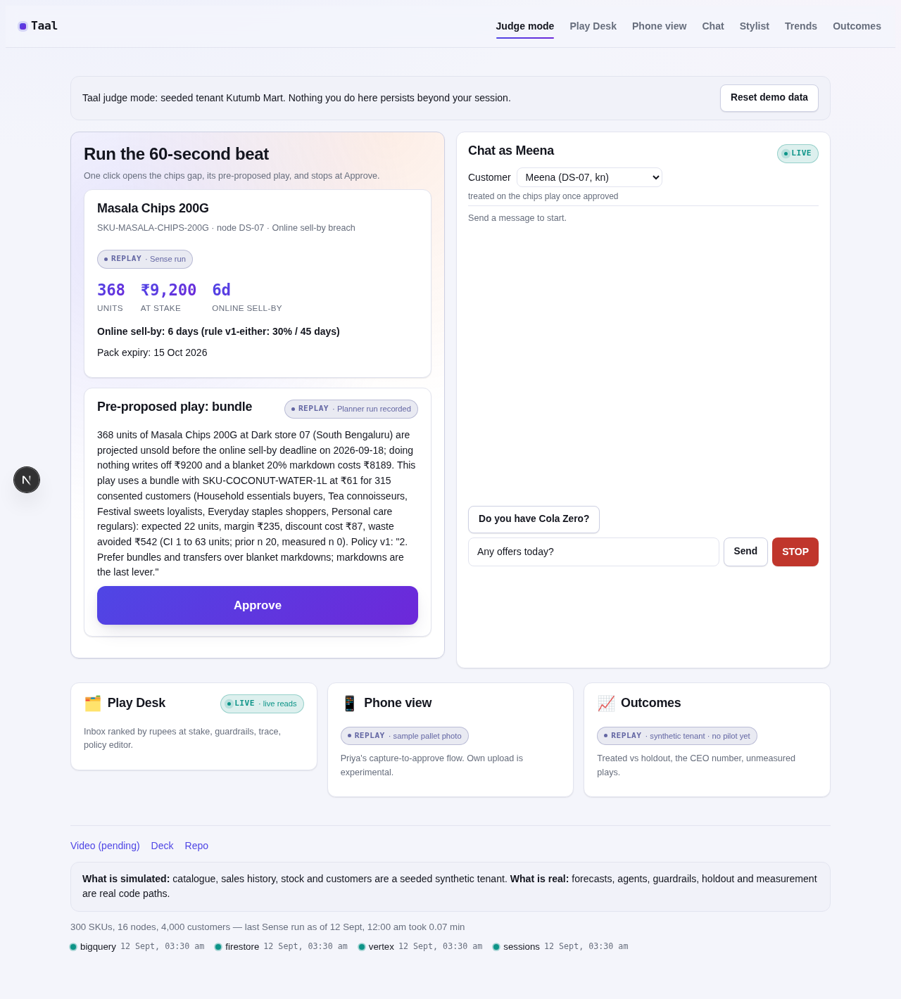
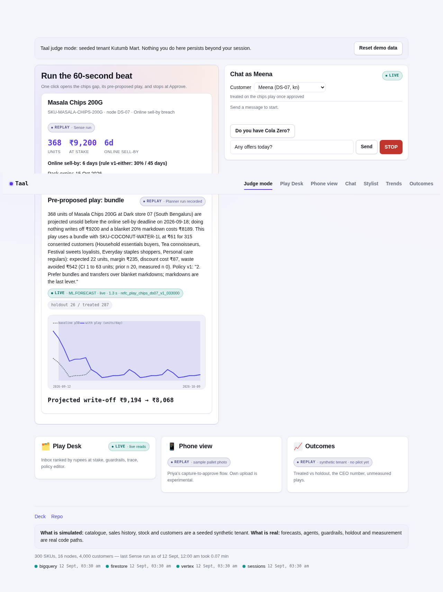
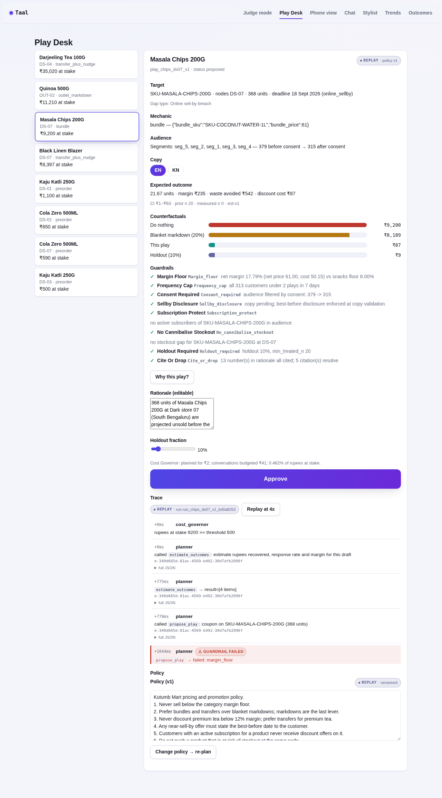
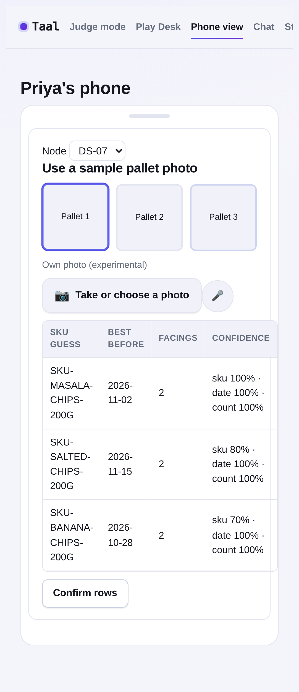
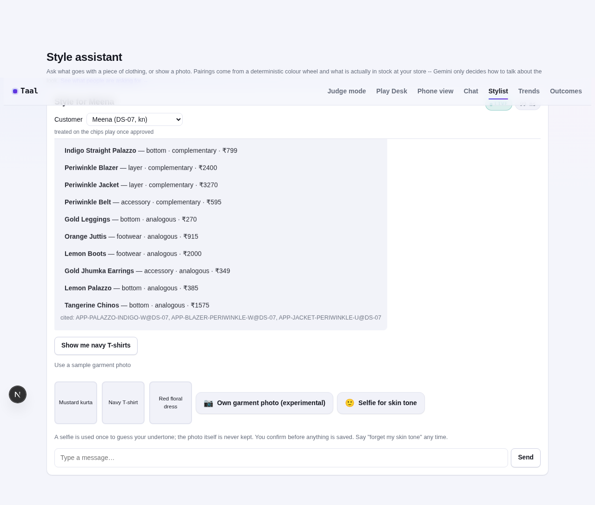
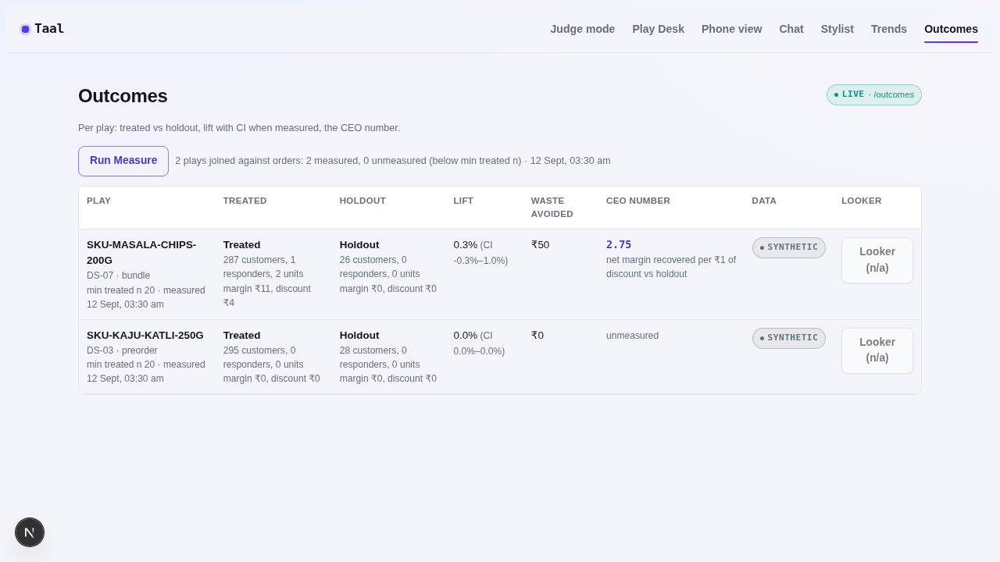

# Taal

The agent that sells what the forecast says you'll throw away.

Retail & Commerce entry for the Google Cloud AI Builder Cup 2026 (JAPAC). Every forecast tells a
retailer what will be written off. Taal turns that into a play for the right customers, at the
right margin, approved by a human, entered into the forecast as a covariate, delivered by an
inventory-aware chat agent, and measured against a holdout.

## Judge quick-start

- Live URL: https://taal-web-2obkp776ca-el.a.run.app (deployed via `infra/deploy.sh`; the local demo runs with `make api` + `make web`, see Development).
- Click **Run the 60-second beat**, then **Approve**, and watch the forecast line move and the write-off change.
- Then **Chat as Meena**: the offer arrives in Kannada with the best-before date; ask for Cola Zero and get what is actually on her shelf.
- Video (under 3 min): _pending_ · Deck: [`docs/deck.pdf`](docs/deck.pdf)
- Live vs replay: every panel carries a LIVE or REPLAY badge. Sense and Plan are nightly and replayed; approve, re-forecast, chat, capture and execution are live calls.
- Reset: **Reset demo data** restores the seeded tenant for your visitor only; nothing you do reaches anyone else.

## Screenshots

Captured with Playwright against the real local stack (`make api` + `make web`, mock mode off,
`TAAL_MODEL_BACKEND=stub`) -- real seeded data, not mocks. `web/tests/live/screens.spec.ts`
reproduces them.

| | |
|---|---|
|  Judge mode landing |  60-second beat: gap card |
|  60-second beat: approved, chart moved |  Play Desk |
|  Phone view: intake table |  Stylist chat: pairing + garment picker |
|  Outcomes: measured | |

## The hook

India's food regulator asks that food delivered online still has 30% of its shelf life or 45 days
left at delivery. A 90-day-shelf-life pack of chips that expires in **33 days** can therefore
only be sold online for **6** more days. No forecasting tool knows that. Taal's sell-by rule is a
versioned tenant parameter (`config/tenant.demo.toml`, `sellby_rule`) shown on every gap card:
the default reads "either condition satisfies" (the earlier of the two cut-offs, which keeps bread
and milk sellable online); the stricter reading is one switch away and retailers set their own.

Demo gap `gap_chips_ds07`: 368 units of Masala Chips at dark store DS-07, ₹9,200 at stake, online
sell-by in 6 days. The planner's first draft (a 15% coupon) fails the margin floor; it revises to a
bundle; approval assigns 287 treated and 26 holdout customers by hash, writes the play into
`future_regressors`, re-forecasts the series in about 1.5 s, and Meena's chat delivers the offer.

## Why this generalizes: one decision loop, not a promo bot

The mechanism behind the hook is not specific to food. A `Play` (`docs/schemas/play.schema.json`)
is a single object -- target, mechanic, audience, guardrails, holdout, expected outcome -- and
`agents/gate/guardrails.py` and `agents/gate/estimator.py` never look at what kind of gap produced
it. The same loop runs today on two different problems with zero domain-specific code in the gate
layer:

- **Grocery**: `online_sellby_breach`, `expiry_writeoff`, `stockout_risk`, `rebalance`,
  `slow_mover` -- a forecast says a lot will go unsold before a deadline.
- **Apparel**: `unmet_demand` and `assortment_gap` -- customers ask the Stylist Agent for a style
  or colour the node does not stock; those real asks become a gap the same Planner, the same eight
  guardrails and the same holdout-measured Play loop can act on
  (`agents/stylist/tools.py`, `jobs/sense/gaps.py`).

Two more things close the loop rather than leaving it open-ended:

1. **Approve doesn't just log a decision, it feeds the forecast.** An approved play is written
   into `future_regressors` and the affected series is re-forecast immediately (the chart moving
   on screen in the 60-second beat *is* this) -- the agent's action becomes the model's next input,
   not a side effect the next Sense run has to catch up to.
2. **The estimator updates from evidence, not just once.** Every Measure run calls
   `update_prior()` (`agents/gate/estimator.py`, `jobs/measure/run.py`) and writes the new
   `alpha`/`beta` back to `estimator_priors`, keyed by mechanic, category and segment -- the next
   play of that shape starts from what was actually measured, not a static assumption.

## What it does

1. **Capture**: a node manager photographs a pallet; dates and counts are read with confidence scores; low-confidence rows must be confirmed before they reach inventory.
2. **Sense** (nightly): per-SKU, per-node forecasts with promo and festival regressors; seven gap types across two domains -- grocery write-off risk (online sell-by breach, expiry write-off, stockout, rebalance, slow mover) and apparel demand signal (unmet demand, assortment gap) -- with rupees at stake; segments; substitutes.
3. **Plan**: an ADK Planner Agent (LlmAgent inside a LoopAgent, max 3 iterations) designs a play with six deterministic tools; every number comes from the estimator; eight guardrails gate it; the Cost Governor decides which gaps are worth a model call.
4. **Approve**: assignment with a holdout, vernacular copy with the best-before line, offers for treated customers only, the play as a known future regressor, the chart moves.
5. **Engage**: a Customer Agent grounded in node stock, offers and consent; orders go through an MCP order endpoint; STOP withdraws consent.
6. **Measure**: treated vs holdout inside the play window, 95% CI, `unmeasured` when the treated arm is too small, estimator priors updated from the exact treated/responder counts so the next play of that shape starts from real evidence, a food-waste line in kg and CO2e labelled as an estimate.

## How Gen AI is used

| Component | Model (id in `config/models.toml`) | What it decides | Deliberately not LLM |
|---|---|---|---|
| Vision intake | `flash` | SKU, best-before date, facings, confidence | which rows need confirmation (threshold); the sell-by date (rule) |
| Planner | `flash` in a LoopAgent | mechanic, audience, rationale, alternatives, revision after a failed guardrail | every rupee (estimator), guardrails, holdout, play validity |
| Copy | `flash` via BigQuery `AI.GENERATE_TABLE` (vertex backend only, at approve time; falls back to templates on any failure/timeout) | vernacular variants | discount values, best-before disclosure (validator; runs on generated and templated copy alike) |
| Customer agent | `flash` | dialogue, substitution reasoning, envelope | stock, offer eligibility, arm, consent, order prices |
| Stylist agent | `flash` (+ vision) | dialogue, which pairing to lead with, reading a garment or selfie photo into attributes | colour theory (hue wheel), stock at the node, the demand-signal write, trend aggregation, colour family and skin-tone confirmation, checkout, and the assortment_gap this demand signal raises when it resolves to real supply elsewhere -- same guardrail-gated, holdout-measured play loop as the grocery gaps |
| Voice | `live` | intent, spoken summary | approve (explicit tool call after confirmation); stub in this build |
| Measure, Sense, Approve | none | | lift, CI, priors, assignment, forecast |

`TAAL_MODEL_BACKEND=stub` (the default and what CI runs) replaces Gemini with scripted models that
follow the same tool protocol, so the ADK agents, tools, session state, escalation and event log
are the real code paths and the decision policy is a script. `vertex` uses the pinned Gemini ids
through Vertex AI. Model ids live only in `config/models.toml`; verify each in Model Garden before the deploy.

## What is real, what is simulated

Real code paths: forecasts, gaps, estimator, guardrails, planner loop, assignment by hash,
re-forecast, chat, MCP orders, measurement. Simulated and disclosed: the tenant Kutumb Mart
(300 SKUs, 10 dark stores, 6 outlets, 4,000 customers, 70 days of sales) comes from a seeded
generator (`data/generator`) whose rule is stated in its docstring. No pilot has run yet; the
Outcomes screen is labelled SYNTHETIC until `docs/pilot.md` says otherwise. The local forecaster
stands in for BigQuery `AI.FORECAST` and `ARIMA_PLUS_XREG` (SQL under `data/bigquery/sense`). The
stylist's apparel catalogue (~350 SKUs across ~45 garment types, sized stock at dark stores) comes
from the same seeded generator on its own RNG stream; the style-trends panel aggregates synthetic
chat asks, not a forecast, and is labelled SYNTHETIC; garment and selfie photo fixtures are
generated colour swatches, never real photos.

## Related work

Two outside references anchor design decisions here, rather than left as unverified intuition:

- **[OTTO's forecasting team, "Team Lumen"](https://cloud.google.com/customers/otto)** put a
  Time-series Dense Encoder (TiDE) model on Vertex AI, BigQuery and GKE and measured up to a 30%
  improvement in demand-forecast accuracy for seasonal inventory. It is the production evidence
  that this project's own choice of stack (BigQuery `AI.FORECAST`/`ARIMA_PLUS_XREG` on Vertex) is
  not a hackathon-only convenience -- the same primitives already carry real retail forecasting
  load elsewhere.
- **Winkelmann, Elbracht, Brenker & Gerzen, ["Discounted Sales of Expiring Perishables: Challenges
  for Demand Forecasting in Grocery Retail Practice"](https://arxiv.org/abs/2602.04464)** (Feb
  2026), a two-step regression study over 1,700+ SKUs across 676 stores of a major European
  grocery retailer, finds that standard demand forecasts systematically underestimate the demand
  uplift a markdown produces on expiring stock -- because the discount itself is not fed back into
  the forecast as a covariate. That is precisely the gap Taal's approve step closes: an approved
  play is written into `future_regressors` and the series is re-forecast with the play as a known
  covariate, rather than left for the next forecast cycle to be surprised by the uplift after the
  fact.

## Related work: AP2 vocabulary for consent and approval

Google's [Agent Payments Protocol (AP2)](https://cloud.google.com/blog/products/ai-machine-learning/announcing-agents-to-payments-ap2-protocol)
names three stages of machine-to-machine consent as signed Mandates: **Intent** (what the user
authorised an agent to do, and its scope), **Cart** (the exact items and price the user approved),
and **Payment** (authorisation to charge a specific instrument). Taal does not implement AP2's
protocol or its cryptographic Verifiable Credentials -- there is no agent-to-agent payment here,
only one retailer's own agent talking to its own customer -- but the same three-stage discipline
already existed in this codebase before AP2 was named, and stating it in AP2's vocabulary makes the
design legible to anyone who already knows that framework:

| AP2 concept | Taal's equivalent |
|---|---|
| Intent Mandate | Marketing consent (`consent` table) plus the guardrail-approved play itself: what this customer may be offered, and under what limits (frequency cap, margin floor) |
| Cart Mandate | `apply_offer(play_id, customer_id)` -- the customer's own `add:<sku>` click locks in the exact play, sku and discount before `place_order` runs |
| Payment Mandate | `place_order(...)` -- the MCP order tool executes the transaction against the cart `apply_offer` already fixed |

"STOP" (`record_stop`) revokes the Intent Mandate outright: the consent gate re-checks it on every
proposed play, not just at signup.

## Evaluation

[`eval/evaluation_table.md`](eval/evaluation_table.md) is the DECISIONS §12 submission table,
built by `make eval-table` from `eval/evaluation.md` and `eval/raw/` -- every cell is parsed from
already-committed, already-measured output, never typed by hand. `eval/evaluation.md` is the dated
narrative behind it: every number names the command that produced it and links to the raw output
committed under `eval/raw/`. Rows §12 asks for that this project genuinely cannot produce yet
(pilot results, Gemini-as-judge scoring, cost from a billing export, planner throughput timing) say
so explicitly in the table rather than a guessed number.

## Development

```
make setup      # uv sync + npm ci (Playwright uses the pre-installed Chromium)
make verify     # secrets -> lint -> schemas -> generate -> unit -> sql -> agents -> api-test -> web-test -> docs -> status
make api        # FastAPI on :8080 against .local/data
make web        # Next.js on :3000 (NEXT_PUBLIC_TAAL_MOCK=1 for fixtures only)
make fixtures   # rebuild committed golden plays, mutations, golden runs, evalsets
make openapi    # regenerate docs/openapi.yaml
```

Green `make verify` is the only definition of done (`harness/`: builder and reviewer prompts,
per-component checklists, `STATUS.md`). Layout and specs: `docs/DECISIONS.md`; data model:
`docs/DATA_MODEL.md`; architecture: `docs/architecture.md`; scale and cost: `docs/scale.md`;
pilot design: `docs/pilot.md`; privacy: `docs/privacy.md`; API: `docs/openapi.yaml`.

## Licence

Apache-2.0 for code. Third-party data terms in `DATA_LICENSES.md`.

## Trying it in GitHub Codespaces

Open the repo on GitHub, Code → Codespaces → Create. The devcontainer installs everything and runs
`make generate`. Then, in two terminals:

```
make api
NEXT_PUBLIC_TAAL_API_URL=https://<your codespace name>-8080.app.github.dev make web
```

Port 8080 is forwarded as public by the devcontainer so the browser can reach the API; port 3000
opens automatically. Stop the Codespace when you are done.
