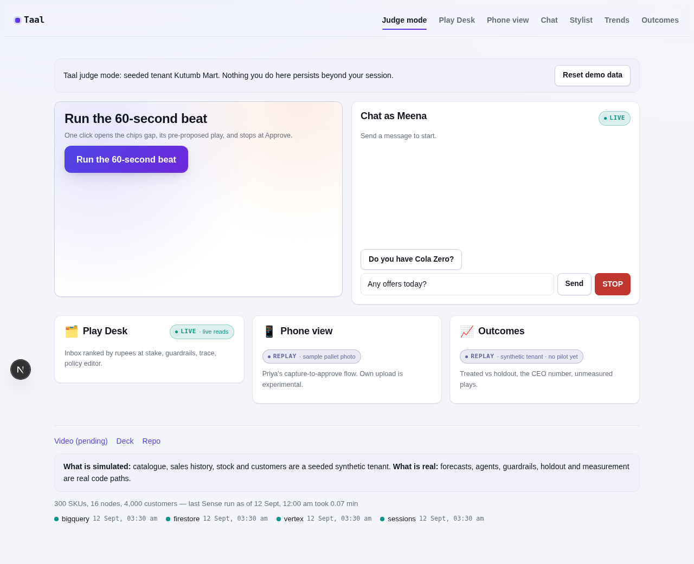
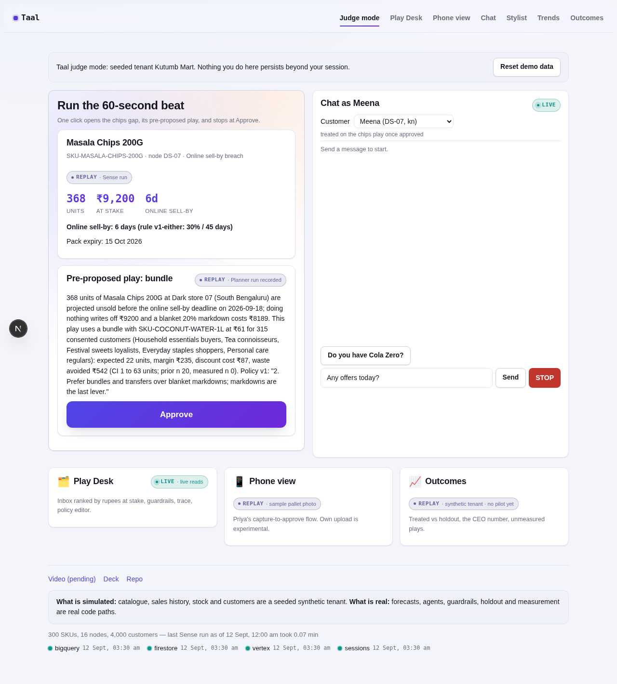
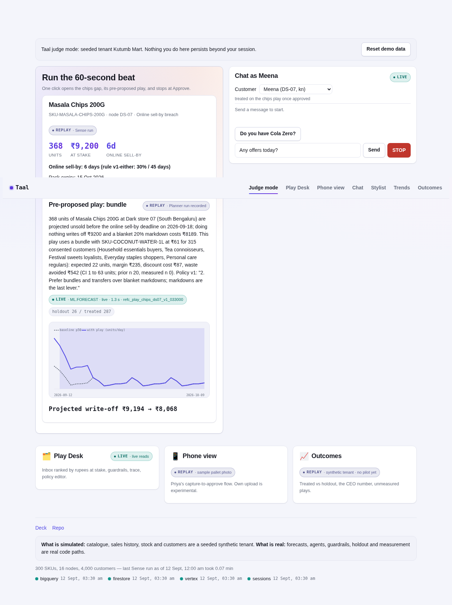
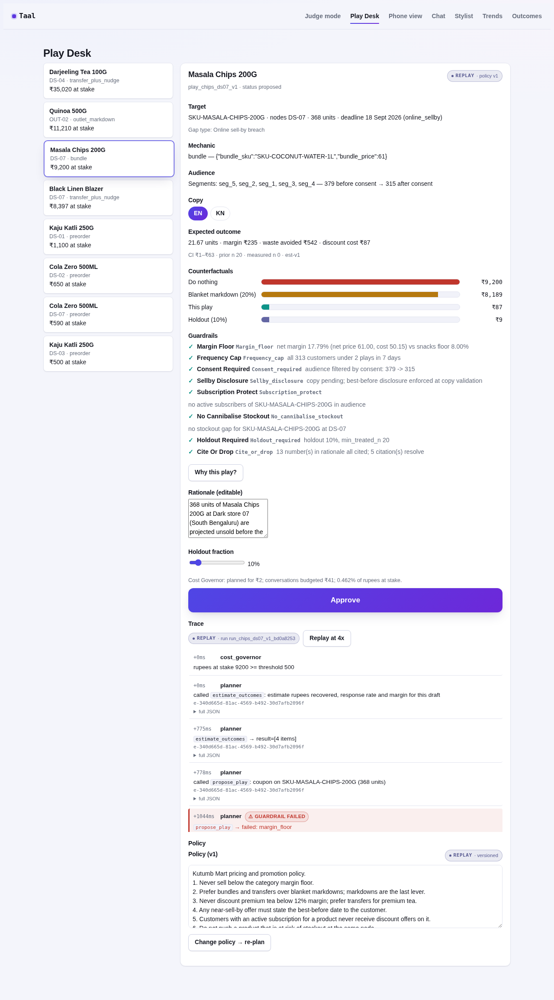
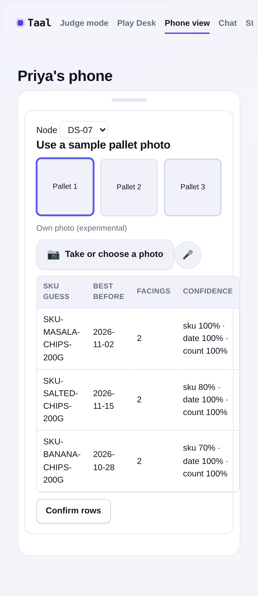
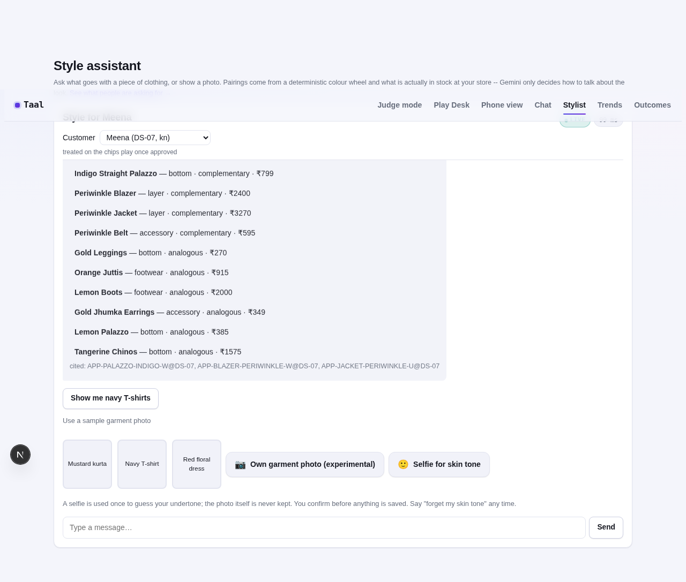
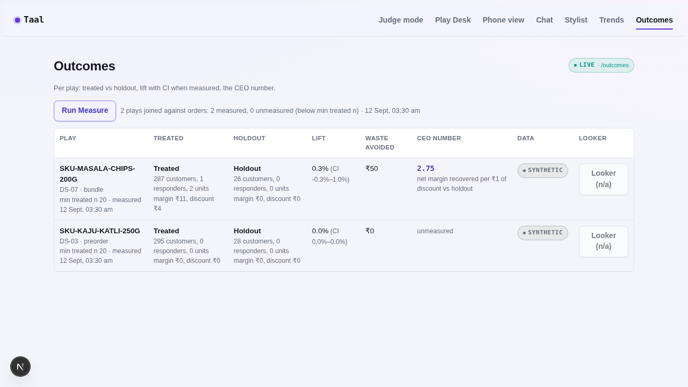

# Taal

The agent that sells what the forecast says you'll throw away.

Retail & Commerce entry for the Google Cloud AI Builder Cup 2026 (JAPAC). Every forecast tells a
retailer what will be written off. Taal turns that into a play for the right customers, at the
right margin, approved by a human, entered into the forecast as a covariate, delivered by an
inventory-aware chat agent, and measured against a holdout.

## Judge quick-start

- Live URL: https://taal-web-2obkp776ca-el.a.run.app (deployed via `infra/deploy.sh`; the local demo runs with `make api` + `make web`, see Development).
- Click **Run the 60-second beat**, then **Approve**: the approved play sets a promo flag on its window in `future_regressors`, and the re-forecast moves the chart. Projection: the play's promo lift applied to its window. Measure tests it against 26 held-back customers (seeded; `eval/raw/flagship_facts_2026-09-27.json`, `approve.holdout_n`).
- Then **Chat as Meena**: the offer arrives in Kannada with the best-before date; ask for Cola Zero and get what is actually on her shelf.
- Video (under 3 min): _pending_ · Deck: [`docs/deck.pdf`](docs/deck.pdf)
- Live vs replay: every panel carries a LIVE/REPLAY (or REAL PILOT/SYNTHETIC) badge -- the play card itself keeps its `REPLAY · policy <version>` badge -- except the Desk's trace panel and its re-plan result, which instead carry one of four provenance badges -- `Recorded from Gemini · <date>`, `Scripted fixture`, `Rules (fallback)`, or `Live · Gemini` -- naming exactly where that trace or run came from. Sense is nightly and replayed; approve, chat, capture and execution are live calls. **Change policy → re-plan** is itself a live, streamed call on the deployed service: it runs Gemini, streams each tool call and guardrail check as they happen, and ends badged with whichever of the four provenance kinds the run actually produced.
- Reset: **Reset demo data** restores the seeded tenant for your visitor only; nothing you do reaches anyone else.

## Impact in numbers

Every number below is reproduced from a committed evidence file or a named code constant, not
typed by hand; see `eval/raw/docs_truth_sweep_2026-09-27/impact_numbers.py` for the script that
reproduced each one.

| What | Number | Label | Source |
|---|---|---|---|
| 28-day exposure on the seeded tenant (one Sense run, 555 gaps; the 28-day horizon bounds 4 of the 7 gap types, `agents/gate/models.py:34-36` -- the other 3 (`stockout_risk`, `unmet_demand`, `assortment_gap`) use each node's `lead_time_days` instead, 3-5 days in the seeded tenant, `data/generator/generate.py:119`) | ₹1,795,464 | seeded | `eval/raw/portfolio_2026-09-24.json` (`totals/exposure_inr`); horizon = `HORIZON`, `jobs/sense/forecast.py:31`; reproduced in `impact_numbers.json` |
| Plays planned | 424 | seeded | `eval/raw/portfolio_2026-09-24.json` (`planned/count`); reproduced in `impact_numbers.json` |
| Expected margin at the default response prior (5%, `agents/gate/estimator.py:35-36`) -- sales margin ₹206,205 plus write-off avoided (net of transfer cost) ₹141,151 | ₹347,356 total | projected | `eval/raw/portfolio_2026-09-24.json` (`plays[*].expected_outcome.margin_inr`, split by mechanic); transfer-cost formula per the `agents/gate/estimator.py` docstring; reproduced in `impact_numbers.json` |
| Monthly running cost of this deployment -- usage measured over the trailing 30 days to 2026-09-23, priced at Google's public list rates; not a bill | ₹486 | measured (usage), list-priced; not a bill | `eval/raw/cost_measurement_2026-09-23.json` (`modeled/total_inr`; method "modeled_from_measured_usage": usage quantities measured over the trailing 30 days, priced at Google's public list rates) |
| Who pays -- a category or supply-chain head; price anchor is a share of waste avoided | -- | projected | `docs/DECISIONS.md:484` |

## Screenshots

Captured with Playwright against the real local stack (`make api` + `make web`, mock mode off,
`TAAL_MODEL_BACKEND=stub`) -- real seeded data, not mocks. `web/tests/live/screens.spec.ts`
reproduces them.

No image in these screenshots, and none of the phone view's sample pallet photos
(`web/public/samples/pallet_0N.jpg`), is a real camera photo: all eight samples are AI-generated
renders (`fixtures/photos/README.md` says how that was determined). Vision accuracy on real phone
photos has not been measured yet.

| | |
|---|---|
|  Judge mode landing |  60-second beat: gap card |
|  60-second beat: approved, chart moved |  Play Desk |
|  Phone view: intake table |  Stylist chat: pairing + garment picker |
|  Outcomes: measured | |

## The hook

FSSAI, India's food regulator, advises e-commerce food business operators
[CITATION: owner to paste primary URL] that food delivered online should still have 30% of its
shelf life or 45 days left at delivery. It is an advisory, not a statute: Taal treats it as the
regulator's advisory, applied as a tenant-set, versioned rule (`config/tenant.demo.toml`,
`sellby_rule`) -- a tenant parameter, not hard-coded. A 90-day-shelf-life pack of chips that
expires in **33 days** can therefore only be sold online for **6** more days under the demo
tenant's own reading. Forecasting tools treat expiry as the deadline; Taal makes the online
sell-by cut-off a first-class gap type. The rule is shown on every gap card: the demo tenant uses
the lenient reading ("either condition satisfies", the earlier of the two cut-offs, which keeps
bread and milk sellable online); the stricter reading is one switch away and retailers set their
own.

Demo gap `gap_chips_ds07`: 368 units of Masala Chips at dark store DS-07, ₹9,200 at stake, online
sell-by in 6 days. In the replayed nightly plan (scripted planner fixture), the planner's first
draft (a 15% coupon) fails the margin floor; it revises to a bundle; approval assigns 287 treated
and 26 holdout customers by hash, writes the play into `future_regressors`, re-forecasts the
series in about 1.6 s (1,554 ms, measured once locally, stub backend), and Meena's chat delivers
the offer. Every number above is reproduced by executing the code on the seeded tenant --
tenant/plan figures labelled seeded, the re-forecast time labelled measured -- in
`eval/raw/docs_truth_sweep_2026-09-27/hook_numbers.json` (gap size, stake and the first-draft
discount also committed in `eval/raw/rationale_judge_plays_2026-09-21/play_chips_ds07_v1.json`).
Demo gap `gap_chips_ds07`: 368 units of Masala Chips at dark store DS-07 (seeded), ₹9,200 at stake
(seeded), online sell-by in 6 days (computed) -- every number in this paragraph is recomputed by
`harness/flagship_facts.py` into `eval/raw/flagship_facts_2026-09-27.json`. The trace judges see for
this gap is the scripted stub planner, badged "Scripted fixture" -- **not** a Gemini run: its first
draft, a 15% coupon (seeded), fails the margin-floor guardrail; it revises to a bundle -- Masala
Chips with Coconut Water 1L, ₹61 for the pair (seeded). A real Gemini recording for this gap could
not be made in the build environment on 27 Sep 2026: no Google Cloud credential exists there.
`harness/record_flagship_traces.py` records one, and `make generate` seeds it automatically once a
recording is committed -- from that point on this gap's trace is badged `Recorded from Gemini ·
<date>` instead. Approval assigns 287 treated and 26 holdout customers by hash (seeded), writes the
play into `future_regressors`, and re-forecasts the series in about 2.0 s (measured locally against
the stub backend, not the deployed service); Meena's chat then delivers the offer. On the deployed
service, **Change policy → re-plan** instead runs Gemini live: the Desk streams each tool call and
guardrail check as it happens, and if no valid play arrives within the configured 45 s deadline
(configured) the deterministic-rules fallback runs instead, badged "Rules (fallback)" with the
reason shown.

## Why this generalizes: one decision loop, not a promo bot

The mechanism behind the hook is not specific to food. A `Play` (`docs/schemas/play.schema.json`)
is a single object -- target, mechanic, audience, guardrails, holdout, expected outcome -- and
`agents/gate/guardrails.py` and `agents/gate/estimator.py` never look at what kind of gap produced
it. The same loop runs on two domains with zero domain-specific code in the gate layer. The
grocery loop:

1. **Online sell-by is a first-class gap type**, not a side note on expiry: `online_sellby_breach`
   sits alongside `expiry_writeoff`, `stockout_risk`, `rebalance` and `slow_mover` as one of the
   forecast-driven gap types a lot can raise before a deadline.
2. **A guardrailed planner drafts the play.** The ADK Planner Agent (`LlmAgent` in a `LoopAgent`)
   proposes a mechanic; `agents/gate/guardrails.py`'s eight rules gate it before it reaches a
   human, revising the play on a failed guardrail rather than failing outright.
3. **Every play gets a hash holdout.** Assignment (`agents/gate/assignment.py`) splits treated vs
   holdout by a deterministic hash of the customer id on every play, never an all-in send.
4. **Measure updates the estimator's prior.** Every Measure run calls `update_prior()`
   (`agents/gate/estimator.py`, `jobs/measure/run.py`) and writes the new `alpha`/`beta` back to
   `estimator_priors`, keyed by mechanic, category and segment -- the next play of that shape
   starts from what was actually measured, not a static assumption.

The same schema also runs an apparel assortment gap; kept in code, not in the pitch.

The loop closes rather than staying open-ended: the approved play sets a promo flag on its window;
the re-forecast applies the fitted promo lift (a projection; Measure tests it against the holdout)
and the chart moves in the 60-second beat, not a side effect the next Sense run has to catch up to.

## What Gemini decides / what it is never allowed to decide

Each row names the code that owns the decision and the test that fails if that boundary moves.
CI runs `TAAL_MODEL_BACKEND=stub` (scripted models, same tools and code paths), so the left-column
tests prove what the model's output must pass through, not how good the model is.

| Gemini decides | Code | Enforced by |
|---|---|---|
| Reading SKU, best-before date and count from a pallet photo, with a confidence per field | `agents/capture/vision.py:99` (`_vertex_rows`) | `tests/agents/test_vision.py:12`: rows validate against the schema; low-confidence rows are flagged |
| Proposing the play: shape, mechanic (and its parameters), audience segments, rationale; revising after a failed guardrail | `agents/planner/agent.py:101` (`LlmAgent` in a `LoopAgent`, max 3 iterations) | `tests/agents/test_planner.py:50`: the chips coupon fails the margin floor and the revision is a different, passing play |
| Offer copy wording, per segment and language (vertex backend only, at approve time; templated otherwise) | `jobs/sense/copy.py:95` (`AI.GENERATE_TABLE` at `:151`), gated by `validate_copy` at `:168` | `tests/unit/test_copy.py:39`: a variant stating the wrong best-before date is rejected |
| What to say to a customer, and which tool to call | `agents/customer/agent.py:38`, turn loop `agents/chat_runtime.py:160`, envelope clamped at `:180` | `tests/agents/test_customer.py:31` (every scripted conversation in `fixtures/conversations/`); `:88`: the exact on-hand count never reaches the customer |

| Never decided by Gemini | Code | Enforced by |
|---|---|---|
| Every rupee: expected units, margin, cost, counterfactuals | `agents/gate/estimator.py:216` (`estimate`); re-checked when a play is proposed, `agents/planner/tools.py:370` (`check_play_money`) | `tests/unit/test_estimator.py:32` (coupon arithmetic against a hand calculation); `tests/unit/test_invariants.py:45` (a play whose margin was altered after estimation is rejected) |
| Guardrail pass/fail: the eight rules | `agents/gate/guardrails.py:266` asserts the rule table equals `GUARDRAIL_RULES` in `agents/gate/models.py:42-45`; `check` at `:269` | `tests/unit/test_guardrails.py:28` (all eight run, in order); `:155` (consent_required ignores any model-written rationale) |
| Who is in the holdout: arm by hash of (customer, seed) | `services/api/approve.py:113` calls `agents/gate/assignment.py:23` (`assign_arm`, SHA-256 bucket) | `tests/unit/test_assignment.py:15` (arm is a pure function of seed and id); `:34` (model-written play fields cannot change an arm) |
| Consent: whether any offer may reach a customer; what STOP does | `agents/customer/tools.py:54` (`_consent_ok`), checked at `:104`, `:218`, `:260`; `record_stop` at `:354` withdraws consent and drops pending offers | `tests/agents/test_customer_gates.py:15`: after `record_stop`, context, `apply_offer` and `negotiate_offer` all refuse with no model turn |
| Forecast numbers, including the re-forecast on approve | `jobs/sense/forecast.py:127` (statistical model, no LLM); approve re-runs it at `services/api/approve.py:144` | `tests/sql/test_forecast.py:23`: an approved play changes p50 inside its window and nowhere else |
| Discount bounds: the category margin floor on every play; the ad-hoc chat discount ceiling | `agents/gate/guardrails.py:76` (`rule_margin_floor`); `agents/customer/tools.py:274` (`min(ad_hoc_max_discount_pct, margin headroom)`) | `tests/unit/test_guardrails.py:53`; `tests/unit/test_estimator.py:82` (property test: margin never below the floor when the gate passes); `tests/agents/test_customer_gates.py:36` (every catalogue sku) |

Two limits, stated rather than hidden. **STOP recognition is the model's call.** The prompt tells
the Customer Agent to call `record_stop` on "STOP" (`agents/customer/prompts/customer.md:38`), and
only the scripted conversations 10-12 cover that step. What STOP does after the call, and every
consent check after it, is code. **The copy validator checks the percentage and the best-before
date, not rupee amounts** in the text (`jobs/sense/copy.py:168`); a bundle price the model misstates
in words would pass it.

## How this differs, by product category

What each category does on the three things this build is designed around. A named product would
appear in a row only with a fetched public documentation page behind each cell. None does: on
2026-09-27 every vendor documentation site tried was refused by this build environment's network
policy, so nothing about any named product could be checked, and no cell here says what any vendor
does or does not do. The Taal row cites code and tests; the category rows are open until a page is
fetched and cited.

| | Treats the online sell-by cut-off as the deadline | Holdout on every play by default | An approved action is fed back into the forecast |
|---|---|---|---|
| **Taal** | Yes: each lot's `online_sellby_date` comes from the tenant's versioned rule (`agents/gate/sellby.py:24`), and a dark-store lot's deadline is that date, not expiry (`jobs/sense/gaps.py`, `deadline = sellby if ...`); `tests/unit/test_sellby.py`, `tests/unit/test_ingest.py` | Yes: `holdout_required` is one of the eight rules every play must pass (`agents/gate/guardrails.py:157`); tenant floor `min_holdout_fraction = 0.05`; `tests/unit/test_guardrails.py:98` | Yes: approve writes the play into `future_regressors` and re-forecasts the series (`services/api/approve.py:144`); `tests/sql/test_forecast.py:23` |
| Markdown-optimisation tools | not verified: public documentation checked on 2026-09-27 could not be fetched | not verified: public documentation checked on 2026-09-27 could not be fetched | not verified: public documentation checked on 2026-09-27 could not be fetched |
| Demand-planning suites | not verified: public documentation checked on 2026-09-27 could not be fetched | not verified: public documentation checked on 2026-09-27 could not be fetched | not verified: public documentation checked on 2026-09-27 could not be fetched |
| CX / marketing agents | not verified: public documentation checked on 2026-09-27 could not be fetched | not verified: public documentation checked on 2026-09-27 could not be fetched | not verified: public documentation checked on 2026-09-27 could not be fetched |

## What it does

1. **Capture**: a node manager photographs a pallet; dates and counts are read with confidence scores; low-confidence rows must be confirmed before they reach inventory.
2. **Sense** (nightly): per-SKU, per-node forecasts with promo and festival regressors; seven gap types -- five grocery write-off-risk types from the forecast (online sell-by breach, expiry write-off, stockout, rebalance, slow mover) plus one grocery demand-signal type from real chat requests (unmet demand) -- with rupees at stake; segments; substitutes. The same schema also runs an apparel assortment gap; kept in code, not in the pitch.
3. **Plan**: an ADK Planner Agent (LlmAgent inside a LoopAgent, max 3 iterations) designs a play with six deterministic tools; every number comes from the estimator; eight guardrails gate it; the Cost Governor decides which gaps are worth a model call.
4. **Approve**: assignment with a holdout, vernacular copy with the best-before line, offers for treated customers only, the play as a known future regressor, the chart moves.
5. **Engage**: a Customer Agent grounded in node stock, offers and consent; orders go through an MCP order endpoint; STOP withdraws consent.
6. **Measure**: treated vs holdout inside the play window, 95% CI, `unmeasured` when the treated arm is too small, estimator priors updated from the exact treated/responder counts so the next play of that shape starts from real evidence, a food-waste line in kg and CO2e labelled as an estimate.

## How Gen AI is used

| Component | Model (id in `config/models.toml`) | What it decides | Deliberately not LLM |
|---|---|---|---|
| Vision intake | `flash` | SKU, best-before date, facings, confidence | which rows need confirmation (threshold); the sell-by date (rule) |
| Planner | `flash` in a LoopAgent | mechanic, audience, rationale, alternatives, revision after a failed guardrail | every rupee (estimator), guardrails, holdout, play validity |
| Copy | `flash` via BigQuery `AI.GENERATE_TABLE` (vertex backend only, at approve time; falls back to templates on any failure/timeout) | vernacular variants | discount values, best-before disclosure (validator; runs on generated and templated copy alike) |
| Customer agent | `flash` | dialogue, substitution reasoning, envelope | stock, offer eligibility, arm, consent, order prices |
| Stylist agent | `flash` (+ vision) | dialogue, which pairing to lead with | colour theory, stock, checkout, the assortment_gap this raises -- apparel; kept in code, not in the pitch |
| Voice | `live` | intent, spoken summary | approve (explicit tool call after confirmation); stub in this build |
| Measure, Sense, Approve | none | | lift, CI, priors, assignment, forecast |

`TAAL_MODEL_BACKEND=stub` (the default and what CI runs) replaces Gemini with scripted models that
follow the same tool protocol, so the ADK agents, tools, session state, escalation and event log
are the real code paths and the decision policy is a script. `vertex` uses the pinned Gemini ids
through Vertex AI. Model ids live only in `config/models.toml`; verify each in Model Garden before the deploy.

## What is real, what is simulated

BigQuery batch path status, the 27 Sep billing outage and the forecasts data-loss bug (found and
fixed before it ran): [eval/incidents_2026-09-27.md](eval/incidents_2026-09-27.md).

| Real | Seeded | Projected |
|---|---|---|
| Judge mode reads a frozen, pinned-clock local snapshot per visitor | Kutumb Mart tenant: 300 grocery SKUs, 10 dark stores, 6 outlets, 4,000 customers, 70 days of sales history (`eval/raw/docs_truth_sweep_2026-09-27/tenant_counts.json`) | Expected margin and write-off avoided after approve, at the default response prior |
| Forecasts (local seasonal-xreg forecaster, `jobs/sense/forecast.py`), gaps, estimator, guardrails, the planner loop code | Apparel catalogue (~350 SKUs) and ~485 style requests (`tenant_counts.json`) | Outcomes screen -- labelled SYNTHETIC until a pilot runs (`docs/pilot.md`) |
| Assignment by hash, re-forecast, chat with Gemini, MCP orders into the local store, measurement code | Garment and selfie photo fixtures: generated colour swatches, never real photos (`docs/DECISIONS.md` §5.9) | -- |
| The nightly BigQuery jobs exist; `AI.FORECAST` verified live once -- see [eval/incidents_2026-09-27.md](eval/incidents_2026-09-27.md) | Play Desk's shown plan: scripted planner fixture, not a recorded Gemini trace (`infra/Dockerfile.api`) | -- |

## Related work

Two outside references anchor design decisions here, rather than left as unverified intuition:

- **[OTTO's forecasting team, "Team Lumen"](https://cloud.google.com/customers/otto)**, as reported
  in Google Cloud's customer story: a Time-series Dense Encoder (TiDE) model, trained on Vertex AI
  and deployed on GKE, drawing on BigQuery as a data source, which the story credits with up to a
  30% improvement in demand-forecast accuracy; the story's own worked example is seasonal
  inventory (gaming consoles). Taal's own forecaster is different: the local seasonal-xreg
  forecaster (`jobs/sense/forecast.py`) in the served demo, and BigQuery `AI.FORECAST` (TimesFM) in
  the nightly job -- verified live once, see
  [eval/incidents_2026-09-27.md](eval/incidents_2026-09-27.md).
- **Winkelmann, Elbracht, Brenker & Gerzen, ["Discounted Sales of Expiring Perishables: Challenges
  for Demand Forecasting in Grocery Retail Practice"](https://arxiv.org/abs/2602.04464)** (Feb
  2026) -- its title names a real, open problem: forecasting demand for discounted, soon-to-expire
  perishables in grocery retail. Taal's own design takes a stance on one piece of that problem: an
  approved play is written into `future_regressors` and the series is re-forecast with the play's
  promo flag as a known covariate, rather than left for the next forecast cycle to be surprised by
  the uplift after the fact.

## Related work: AP2 vocabulary for consent and approval

Google's [Agent Payments Protocol (AP2)](https://cloud.google.com/blog/products/ai-machine-learning/announcing-agents-to-payments-ap2-protocol)
names three stages of machine-to-machine consent as signed Mandates: **Intent** (what the user
authorised an agent to do, and its scope), **Cart** (the exact items and price the user approved),
and **Payment** (authorisation to charge a specific instrument). Taal does not implement AP2's
protocol or its cryptographic Verifiable Credentials -- there is no agent-to-agent payment here,
only one retailer's own agent talking to its own customer -- but the same three-stage discipline
already existed in this codebase before AP2 was named, and stating it in AP2's vocabulary makes the
design legible to anyone who already knows that framework:

| AP2 concept | Taal's equivalent |
|---|---|
| Intent Mandate | Marketing consent (`consent` table) plus the guardrail-approved play itself: what this customer may be offered, and under what limits (frequency cap, margin floor) |
| Cart Mandate | `apply_offer(play_id, customer_id)` -- the customer's own `add:<sku>` click locks in the exact play, sku and discount before `place_order` runs |
| Payment Mandate | `place_order(...)` -- the MCP order tool executes the transaction against the cart `apply_offer` already fixed |

"STOP" (`record_stop`) revokes the Intent Mandate outright: the consent gate re-checks it on every
proposed play, not just at signup.

## Bring your own data

- **Three files**: `products.csv`, `inventory_batches.csv`, `sales.csv` (columns in [`docs/scale.md`](docs/scale.md#the-three-csv-ingestion-contract); worked example in [`data/samples/`](data/samples/)); `nodes.csv` and `inbound.csv` are optional.
- **One command**: `uv run python -m data.ingest --products products.csv --batches inventory_batches.csv --sales sales.csv --tenant config/tenant.<name>.toml --out .local/data-<name>` (copy `config/tenant.demo.toml` to set your sell-by rule, margin floors and thresholds).
- **What you get back**: every lot flagged under your online sell-by rule, units and rupees at stake by gap type, the ten largest gaps, and the stock already past its online sell-by or expiry; errors name the file, line and column.
- **Nothing leaves the machine**: ingest pins the store and forecaster to local files and switches off the serving cache, whatever your environment says.
- **A pilot is one command from here**: `TAAL_DATA_DIR=.local/data-<name> TAAL_TENANT_CONFIG=config/tenant.<name>.toml make api` serves those gaps over the same API the Play Desk reads (`eval/raw/ingest_roundtrip_2026-09-27/api_probe.txt`). Planning a play returns `no_play` until customer and consent tables exist, because the three files carry no audience; that is the pilot's first step ([`docs/pilot.md`](docs/pilot.md)).

## Evaluation

[`eval/evaluation_table.md`](eval/evaluation_table.md) is the DECISIONS §12 submission table,
built by `make eval-table` from `eval/evaluation.md` and `eval/raw/` -- every cell is parsed from
already-committed, already-measured output, never typed by hand. `eval/evaluation.md` is the dated
narrative behind it: every number names the command that produced it and links to the raw output
committed under `eval/raw/`. Rows §12 asks for that this project genuinely cannot produce yet
(pilot results, Gemini-as-judge scoring, cost from a billing export, planner throughput timing) say
so explicitly in the table rather than a guessed number.

## Development

```
make setup      # uv sync + npm ci (Playwright uses the pre-installed Chromium)
make verify     # secrets -> lint -> schemas -> generate -> unit -> sql -> agents -> api-test -> web-test -> docs -> status
make api        # FastAPI on :8080 against .local/data
make web        # Next.js on :3000 (NEXT_PUBLIC_TAAL_MOCK=1 for fixtures only)
make fixtures   # rebuild committed golden plays, mutations, golden runs, evalsets
make openapi    # regenerate docs/openapi.yaml
```

Green `make verify` is the only definition of done (`harness/`: builder and reviewer prompts,
per-component checklists, `STATUS.md`). Layout and specs: `docs/DECISIONS.md`; data model:
`docs/DATA_MODEL.md`; architecture: `docs/architecture.md`; scale and cost: `docs/scale.md`;
pilot design: `docs/pilot.md`; privacy: `docs/privacy.md`; API: `docs/openapi.yaml`.

## Licence

Apache-2.0 for code. Third-party data terms in `DATA_LICENSES.md`.

## Trying it in GitHub Codespaces

Open the repo on GitHub, Code → Codespaces → Create. The devcontainer installs everything and runs
`make generate`. Then, in two terminals:

```
make api
NEXT_PUBLIC_TAAL_API_URL=https://<your codespace name>-8080.app.github.dev make web
```

Port 8080 is forwarded as public by the devcontainer so the browser can reach the API; port 3000
opens automatically. Stop the Codespace when you are done.
