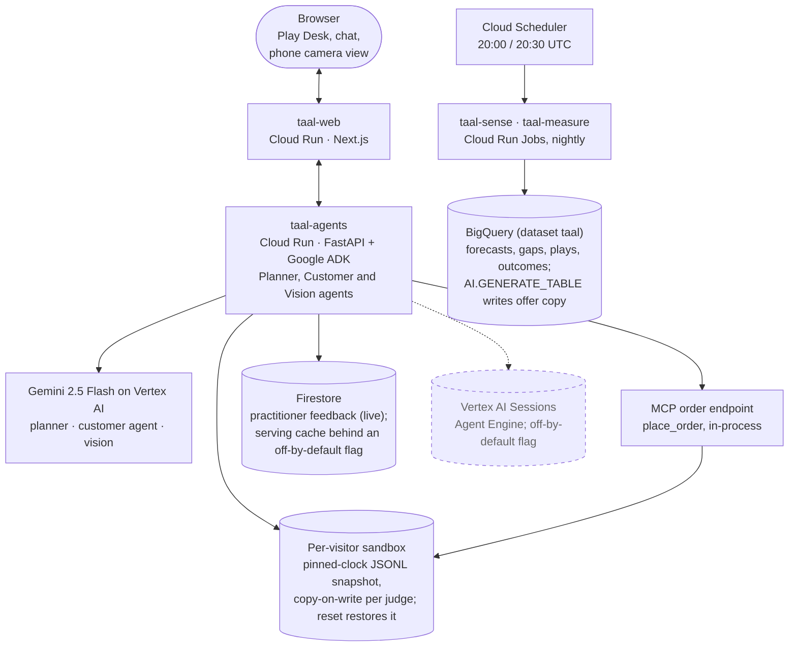

# Architecture

Services and data flow per DECISIONS §4. All request paths below are measured against the
latency budget in §4.3; none of the numbers here are pilot results (see `docs/pilot.md` for those).

## Services and data flow

Rendered copy for the README: [`architecture.svg`](architecture.svg), from this block with
`npx -y @mermaid-js/mermaid-cli -i <block.mmd> -o docs/architecture.svg` (flowchart
`htmlLabels: false`, `neutral` theme).

## Request paths (numbered to match the video beats)

1. **Capture.** Phone view uploads a photo to `taal-agents`; Vision
   intake writes confirmed rows to `taal.inventory_batches` with `source='photo'`.
2. **Sense → Plan.** The nightly `taal-sense` job (or an on-demand re-run) computes forecasts and
   gaps, then fans out gaps to the Planner Agent, which proposes plays. `taal-agents`'s own
   judge-mode serving path always reads a frozen, pinned-clock local snapshot and never touches
   BigQuery directly. `jobs/sense`/`jobs/measure` support two backends behind env vars that
   default to local everywhere except the `taal-sense`/`taal-measure` jobs' own environment:
   `TAAL_FORECAST_BACKEND=local|bigquery_timesfm` and `TAAL_BATCH_STORE=local|bigquery`.
   `bigquery_timesfm` (BigQuery `AI.FORECAST`) was verified live for real (25,060 rows across 895
   series; no covariate parameter; a real SQL bug found and fixed) -- evidence under
   `eval/raw/bigquery_ai_forecast_2026-09-27/`. We benchmarked BigQuery `AI.FORECAST` (TimesFM) against the local seasonal model on 45 backtest comparisons (5 origins x 9 category tiers); the local model won 45/45, so the judge-facing path uses the local forecaster; the nightly `taal-sense` job still runs `AI.FORECAST` (`infra/deploy.sh:309`) and its output is not read by the judge-facing path. `TAAL_BATCH_STORE=bigquery` (writes through
   `BigQueryStore`) is written and unit-tested; `forecasts` writes were verified safe in a live dry
   run after a real data-loss bug was found and fixed (a tenant-wide `DELETE` on a history table),
   and a separate bug in the same write path (an unscoped BigQuery load silently reordering and
   dropping nested `STRUCT` fields) was found and fixed too -- see
   `eval/raw/bigquery_forecast_dataloss_2026-09-27/`. `taal.gaps`'s DDL/code mismatch (`evidence`
   was missing 15 real fields `jobs/sense/gaps.py` emits, across every gap type) has been migrated
   live and verified via `INFORMATION_SCHEMA`; `infra/deploy.sh` now applies this migration
   idempotently on every deploy -- see `eval/raw/bigquery_schema_migration_2026-09-27/finding.json`.
   A billing/payment issue on the GCP project also briefly blocked all BigQuery writes on
   2026-09-27, since resolved and re-verified live twice, an hour apart -- see
   `eval/raw/bigquery_billing_dml_2026-09-27/finding.json` for the timeline. **The nightly BigQuery
   batch path is now verified end-to-end against a staging clone of `taal`** (a full `jobs.sense`
   run: 533 gaps across all 6 real gap types, all rebalance gaps carrying `counterpart_gap_id`,
   prior forecast runs untouched); it has not yet been run for real against `taal` itself.
3. **Approve.** A human approves a play in the Play Desk; `taal-agents` writes
   `play_assignments`, then sets a promo flag (`on_promo=True`) on the play's SKU/clusters inside
   the play window in `future_regressors` (`services/api/approve.py:128-138`). Approve re-runs the
   local seasonal-xreg forecaster (`jobs/sense/forecast.py`) for the play's SKU, in process; the
   re-forecast applies the fitted promo lift (a projection; Measure tests it against the holdout).
   BigQuery `ML.FORECAST` on `ARIMA_PLUS_XREG` was verified separately
   (`eval/raw/bigquery_arima_xreg_forecast_2026-09-23.json`) and is not on the approve path.
4. **Engage.** The Customer Agent reads `pending_offers` and marketing consent from the
   visitor's own sandbox store (never a shared cache: Approve and STOP change them per visitor)
   and delivers the play. A customer's order is written by `place_order`
   (`agents/customer/tools.py`) through the in-process MCP order mock
   (`agents/mcp_orders/server.py`) to that same local store's `orders` / `order_lines` tables with
   `play_id` set, not directly to BigQuery. Two Google Cloud integrations exist for this path,
   each behind its own flag and **both off in the deployed service** until their live acceptance
   runs are committed (`infra/deploy.sh`, `ENABLE_VERTEX_SESSIONS` / `ENABLE_SERVING_CACHE`):
   - **Vertex AI Sessions** (`TAAL_SESSION_BACKEND=vertex`, `agents/vertex_sessions.py`): chat
     history kept on an Agent Engine across container restarts. Every ADK session is keyed
     `<visitor>:<customer_id>:web` (user `<visitor>:<customer_id>`), so two judges chatting as the
     same customer never share a session, and `/reset` deletes the visitor's sessions. Off: an
     in-memory session per visitor sandbox, lost on restart.
   - **Firestore serving cache** (`TAAL_SERVING_CACHE=firestore`, `agents/gate/firestore_cache.py`):
     stock and customer-profile docs mirrored at deploy time from the same seeded snapshot and
     `TAAL_NOW` the image serves. Served only when the visitor has no overlay rows in the source
     tables and the doc's `as_of`/`snapshot_id` match the serving clock and image; otherwise, and
     on any Firestore error, the turn reads the store. Off: every read goes to the store.
5. **Measure.** The nightly Measure job joins `orders` to `play_assignments` inside the play
   window, writes `play_outcomes` (treated vs holdout), and updates `estimator_priors`. With
   `TAAL_BATCH_STORE=bigquery` (the `taal-measure` job) it reads `plays`/`play_assignments` from
   BigQuery but `order_lines`/`estimator_priors` from the job image's local snapshot. When
   BigQuery holds no plays it logs exactly one line and exits 0 without writing anything: "0
   plays to measure: judge-mode approvals are per-visitor sandboxes and are never written to
   BigQuery by design". `make nightly-report` records whether each execution logged it
   (`eval/raw/nightly_runs/`). A Looker Studio report over `play_outcomes` is designed
   (DECISIONS §5.8) but not wired into this repo: the Outcomes page shows a Looker link only
   when a `looker_url` is present (`services/api/main.py`, `os.environ.get("TAAL_LOOKER_URL")`),
   and nothing in this repo -- `infra/deploy.sh` included -- sets that variable, so the link
   never renders today.

## Latency budget (DECISIONS §4.3)

| Path | Budget | Notes |
|---|---|---|
| Customer Agent turn | < 3 s p50 / < 6 s p95 | Flash, streaming; stock from the visitor's local store (`LocalStore`/`OverlayStore`), or the Firestore serving cache when `TAAL_SERVING_CACHE=firestore` (`infra/deploy.sh` sets it only when `ENABLE_SERVING_CACHE=1`, hard-coded to 0 at `infra/deploy.sh:22`, so it is off in the deployed service); substitutes precomputed; no per-turn memory calls |
| Vision intake (one photo) | < 8 s | Gemini image understanding, strict output schema |
| Planner, one gap | 20-60 s | nightly batch, or streamed on an on-demand re-run |
| Approve → re-forecast | < 15 s | Approve re-runs the local seasonal-xreg forecaster (`jobs/sense/forecast.py`) for the play's SKU, in process; BigQuery `ML.FORECAST` on `ARIMA_PLUS_XREG` was verified separately (`eval/raw/bigquery_arima_xreg_forecast_2026-09-23.json`) and is not on the approve path |
| Sense job (full nightly run) | minutes | never a live request path |

All figures in this table are **estimated** budgets from DECISIONS §4.3, not measurements. No
Cloud Trace wiring exists in this repo; real measured latency numbers instead live in
`eval/raw/` (e.g. `eval/raw/customer_latency_fix_2026-09-21.json`,
`eval/raw/customer_latency_fix_summary_2026-09-21.json`, `eval/raw/sweep_vertex_2026-09-21.txt`),
and the judge-mode footer's latency chips show the measured number for that specific request
(`envelope.latency_ms`/`elapsed_ms` returned by the API call itself, per `web/lib/api.ts`,
`services/api/approve.py`), not a Cloud Trace query.
| Planner, one gap (on-demand re-plan) | `POST /rerun` answers `202` at once; deadline **90 s** (configured on `taal-agents`; `eval/raw/flagship_facts_2026-09-27.json`) | The Desk streams each tool call and guardrail check live over SSE until `event: done`; nothing waits on the model synchronously. Last measured real Gemini **end-to-end** latency: **24.0-43.3 s** over 4 runs that reached the model (measured 2026-09-24, real Vertex; `eval/raw/planner_prompt_v6_2026-09-24/summary.json`, via the facts file above) -- before the deadline was raised from 45 s to 90 s (a later live check saw 41-48 s, so about a third of runs hit the old 45 s limit). p50/p95 and fallback rate *at* the 90 s deadline: not yet measured -- no Google Cloud credential exists in this build container (`harness/record_flagship_traces.py`, `harness/measure_live_rerun.py` are committed and produce it once one exists; see `eval/evaluation.md`, "Planner: recorded traces and live re-plan"). |
| Approve → re-forecast | < 15 s | single-series `ML.FORECAST` on a nightly pre-trained `ARIMA_PLUS_XREG` model; approve only updates `future_regressors` and re-runs `ML.FORECAST`, never retrains |
| Sense job (full nightly run) | minutes | never a live request path |

Most figures in this table are **estimated** budgets from DECISIONS §4.3, not measurements. The
Planner row is the exception: its deadline is a real configured value and its latency range a real,
dated measurement (citations in the row itself) -- but not yet the p50/p95 and fallback rate at that
90 s deadline specifically, which needs a real Vertex credential this build environment does not
have (`eval/evaluation.md`). The build replaces the remaining estimated rows with measured p50/p95
from Cloud Trace once services are deployed, and the judge-mode footer's latency chips show the
measured number for that run.

## What Gemini decides / what it is never allowed to decide

Each row names the code that owns the decision and the test that fails if that boundary moves.
CI runs `TAAL_MODEL_BACKEND=stub` (scripted models, same tools and code paths), so the left-column
tests prove what the model's output must pass through, not how good the model is.

| Gemini decides | Code | Enforced by |
|---|---|---|
| Reading SKU, best-before date and count from a pallet photo, with a confidence per field | `agents/capture/vision.py:99` (`_vertex_rows`) | `tests/agents/test_vision.py:12`: rows validate against the schema; low-confidence rows are flagged |
| Proposing the play: shape, mechanic (and its parameters), audience segments, rationale; revising after a failed guardrail | `agents/planner/agent.py:101` (`LlmAgent` in a `LoopAgent`, max 3 iterations) | `tests/agents/test_planner.py:50`: the chips coupon fails the margin floor and the revision is a different, passing play |
| Offer copy wording, per segment and language (vertex backend only, at approve time; templated otherwise) | `jobs/sense/copy.py:95` (`AI.GENERATE_TABLE` at `:151`), gated by `validate_copy` at `:168` | `tests/unit/test_copy.py:39`: a variant stating the wrong best-before date is rejected |
| What to say to a customer, and which tool to call | `agents/customer/agent.py:38`, turn loop `agents/chat_runtime.py:160`, envelope clamped at `:180` | `tests/agents/test_customer.py:31` (every scripted conversation in `fixtures/conversations/`); `:88`: the exact on-hand count never reaches the customer |

| Never decided by Gemini | Code | Enforced by |
|---|---|---|
| Every rupee: expected units, margin, cost, counterfactuals | `agents/gate/estimator.py:216` (`estimate`); re-checked when a play is proposed, `agents/planner/tools.py:370` (`check_play_money`) | `tests/unit/test_estimator.py:32` (coupon arithmetic against a hand calculation); `tests/unit/test_invariants.py:45` (a play whose margin was altered after estimation is rejected) |
| Guardrail pass/fail: the eight rules | `agents/gate/guardrails.py:266` asserts the rule table equals `GUARDRAIL_RULES` in `agents/gate/models.py:42-45`; `check` at `:269` | `tests/unit/test_guardrails.py:28` (all eight run, in order); `:155` (consent_required ignores any model-written rationale) |
| Who is in the holdout: arm by hash of (customer, seed) | `services/api/approve.py:113` calls `agents/gate/assignment.py:23` (`assign_arm`, SHA-256 bucket) | `tests/unit/test_assignment.py:15` (arm is a pure function of seed and id); `:34` (model-written play fields cannot change an arm) |
| Consent: whether any offer may reach a customer; what STOP does | `agents/customer/tools.py:54` (`_consent_ok`), checked at `:104`, `:218`, `:260`; `record_stop` at `:354` withdraws consent and drops pending offers | `tests/agents/test_customer_gates.py:15`: after `record_stop`, context, `apply_offer` and `negotiate_offer` all refuse with no model turn |
| Forecast numbers, including the re-forecast on approve | `jobs/sense/forecast.py:127` (statistical model, no LLM; the deployed tenant's default backend, `TAAL_FORECAST_BACKEND` unset per `jobs/sense/run.py`); approve re-runs it at `services/api/approve.py:144`. The nightly `taal-sense` job instead runs with `TAAL_FORECAST_BACKEND=bigquery_timesfm` (BigQuery `AI.FORECAST`/TimesFM, verified live, `eval/raw/bigquery_ai_forecast_2026-09-27/`) -- either way a statistical model, not agent reasoning | `tests/sql/test_forecast.py:23`: an approved play changes p50 inside its window and nowhere else |
| Discount bounds: the category margin floor on every play; the ad-hoc chat discount ceiling | `agents/gate/guardrails.py:76` (`rule_margin_floor`); `agents/customer/tools.py:274` (`min(ad_hoc_max_discount_pct, margin headroom)`) | `tests/unit/test_guardrails.py:53`; `tests/unit/test_estimator.py:82` (property test: margin never below the floor when the gate passes); `tests/agents/test_customer_gates.py:36` (every catalogue sku) |

Two limits, stated rather than hidden. **STOP recognition is the model's call.** The prompt tells
the Customer Agent to call `record_stop` on "STOP" (`agents/customer/prompts/customer.md:38`), and
only the scripted conversations 10-12 cover that step. What STOP does after the call, and every
consent check after it, is code. **The copy validator checks the percentage and the best-before
date, not rupee amounts** in the text (`jobs/sense/copy.py:168`); a bundle price the model misstates
in words would pass it.

This is the one-line version from DECISIONS §2.7: "The rules decide what is allowed; Gemini
decides what to do; the estimator owns the numbers."
